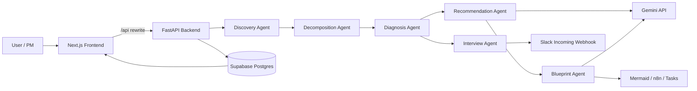

# AI BizOps Orchestrator MVP v0

AI BizOps Orchestrator MVPは、  
社内業務の流れを自然文から読み取り、非効率な作業や連携不足を見つけ、  
改善案、業務接続設計図、追加ヒアリング、実装イメージまで一連で見える化する  
BizOps / RevOps 向け MVP です。

単なる業務メモの要約ツールではなく、  
**業務・SaaS・AI 活用・承認フローを横断して、  
PL / BS / ROI に効く全体最適へ再構成すること**を目的にしています。

### 実装方法：AI活用によるMVP開発（バイブコーディング&AIペアプログラミング）
AIを単なるコード生成ツールとしてではなく、
設計から実装までを伴走する「専属メンター」として活用したMVP開発を行いました。
単にAIの出力をコピペする「バイブコーディング」に留まらず、
タスク単位で設計意図や専門用語の理解、エラー原因の解説をAIに求め、
納得した上で自身の手で実装・実行する
「Review-First（レビュー先行型）AI開発」にて構築。

---
## デモ画面URL
https://ai-biz-ops-orchestrator-frontend.vercel.app/

---

## Overview

現場の業務は、担当者にとっては「普通のやり方」でも、  
第三者視点で見ると次の問題を抱えがちです。

- 手作業や転記が多い
- SaaS 同士がつながっていない
- 重複しているツールがある
- AI を入れられる箇所が見えていない
- 承認や確認の流れが属人化している

このプロダクトは、そうした業務を自然文で受け取り、  
構造化し、診断し、改善のたたき台まで落とします。  
PM や現場責任者が「今どこが詰まっていて、何から直すべきか」を  
短時間で把握できることを狙っています。

## What I Built

この MVP では、以下を一気通貫で実装しています。

- 組織、部署、ツール、業務フローの登録
- 自然文による業務入力
- 業務ステップ分解
- ルールベース診断
- Gemini による改善提案生成
- Mermaid による業務接続設計図の生成と画面表示
- Slack 向け追加ヒアリング質問文の生成
- n8n JSON ドラフト生成
- 実装タスク生成
- Supabase への保存と再表示
- Slack回答の手動保存と再診断導線

## Why This Matters

### ビジネス目線

- 改善余地の可視化
- ROI 仮説の提示
- 意思決定材料の整理
- 実装優先順位の明確化

### エンジニア目線

- 自然文入力から構造化データへの変換
- ルールベース診断と LLM 生成の役割分離
- 保存、再表示、再診断までつながる分析フロー
- Mermaid / Slack / n8n まで含めた出力設計

## Architecture

### System Diagram



### Responsibility Split

backend は PRD に沿って次の責務に分割しています。

- Discovery Agent
- Decomposition Agent
- Diagnosis Agent
- Recommendation Agent
- Interview Agent
- Blueprint Agent

これは別サービスへの分散ではなく、  
**分析責務をサービス単位で分ける内部設計**です。  
この構成により、業務分解、診断、提案、質問生成、設計図生成を  
それぞれ独立して改善しやすくしています。

## Tech Stack

### Frontend

- Next.js
- TypeScript

採用理由:

- UI 構築が速い
- Vercel と相性がよい
- rewrite により frontend / backend 分離を保ったまま API 接続を構成しやすい

### Backend

- FastAPI
- Python

採用理由:

- API 実装が軽量で速い
- request / response の型を整理しやすい
- LLM、Supabase、Slack 連携を実装しやすい

### Database

- Supabase Postgres

採用理由:

- Postgres の安定性
- Hosted 環境で本保存をすぐ検証できる
- MVP でも保存と再表示を実データで確認しやすい

### AI / Notification

- Gemini API
- Slack Incoming Webhook
- Mermaid
- n8n JSON

## How It Works

このプロダクトは、単に自然文を分解して終わりではなく、  
次の流れで組み立てています。

1. 組織、部署、ツール、業務を登録
2. 自然文の業務説明を受け取る
3. 業務ステップへ分解
4. ボトルネック、未接続、手作業、承認候補を診断
5. 改善提案、統廃合提案、AI 介在案を生成
6. 追加ヒアリング質問を生成
7. Mermaid 設計図、n8n draft、実装タスクを生成
8. 結果を Supabase に保存し、再表示する

## Acceptance Test Scenarios

### Scenario 1: 手作業が多い定例レポート業務

#### 入力例

- 組織: `Revenue Ops Team`
- ツール:
  - `HubSpot`
  - `Google Sheets`
  - `Slack`
- 業務説明:

```text
毎朝 HubSpot の商談件数と失注件数を目視で確認し、Google Sheets のレポートを手作業で更新する。
更新後、その内容をもとに営業会議用のアジェンダを作成し、Slack で共有する。
```

#### 期待される表示

- 分解結果:
  - HubSpot を確認するステップ
  - Google Sheets を更新するステップ
  - 会議アジェンダを作るステップ
  - Slack 共有ステップ
- 診断結果:
  - 手作業更新
  - 転記コスト
  - 会議準備の自動化余地
- 提案:
  - CRM からレポート更新の自動化
  - 会議アジェンダ生成の AI 活用
- Blueprint:
  - `HubSpot -> AI Transform -> Google Sheets -> Slack`
- n8n:
  - 定期実行ベースのドラフト

#### 何が確認できるか

- 自然文から業務ステップへ分解できるか
- 手作業と会議準備が診断対象になるか
- 自動化提案が Mermaid / n8n までつながるか

### Scenario 2: ツール重複と保管先の分散

#### 入力例

- 組織: `Corporate Planning`
- ツール:
  - `Google Drive`
  - `Box`
  - `Slack`
- 業務説明:

```text
資料は案件によって Google Drive と Box の両方に保存されている。
どちらが正式な保管先かが曖昧で、会議前に担当者が両方を探して最新版を確認している。
```

#### 期待される表示

- 診断結果:
  - 重複 SaaS
  - 正式保管先の曖昧さ
  - 目視確認コスト
- 質問生成:
  - `どちらが正式な保管先か`
  - `移行できない理由はあるか`
- 提案:
  - 保管ルール統一
  - 統廃合判断

#### 何が確認できるか

- 統廃合候補を検出できるか
- 不足情報を Interview Agent が質問に落とせるか
- 単なる自動化ではなく、運用ルールの整理提案まで出せるか

### Scenario 3: 承認フローが残る会議後処理

#### 入力例

- 組織: `BizOps PMO`
- ツール:
  - `Zoom`
  - `Notion`
  - `Slack`
- 業務説明:

```text
会議後に議事録を Notion にまとめ、次のアクションを洗い出す。
ただし、社外共有前には必ずマネージャーが内容を確認してから Slack で展開している。
```

#### 期待される表示

- 診断結果:
  - 会議後処理の自動化余地
  - Human in the Loop が必要な承認箇所
- 質問生成:
  - `最終的に誰が承認しているか`
- 提案:
  - 議事録要約の AI 活用
  - 承認後だけ配信する運用設計

#### 何が確認できるか

- 全自動化せず、承認を残す提案が出るか
- Human-in-the-loop 設計の考え方が反映されるか

### Scenario 4: 保存済み結果の再利用

#### 操作例

1. 提案文を生成する
2. 同じ組織で再度 `保存済み提案文を表示` を押す
3. 必要なら `再生成する` を押す

#### 期待される表示

- 2回目は保存済み結果が返る
- `再生成する` を押したときだけ新しい生成が走る

#### 何が確認できるか

- Gemini API を無駄に消費しない設計になっているか
- 保存済み結果と再生成の責務が分かれているか

### Scenario 5: 回答保存から再診断まで

#### 操作例

1. Slack質問案を生成する
2. UI 上で回答を入力する
3. `回答を保存`
4. `再診断` を実行する

#### 期待される表示

- 質問が `回答済み` になる
- 保存済み回答が表示される
- 再診断後に findings / recommendations が更新される

#### 何が確認できるか

- 不足情報の回収が一方向で終わらないか
- 質問生成と診断更新がループとしてつながっているか

## Technical Highlights

### 1. Rule-based diagnosis と LLM generation の分業

診断の中核はルールベース、生成文や Blueprint は LLM に寄せています。  
この判断により、MVP でも **再現性** と **柔軟な提案生成** を両立しています。

### 2. Natural language to structured workflow

自然文の業務説明を、そのまま保存するのではなく、  
業務ステップ、課題候補、提案、設計図へ段階的に変換しています。  
分析を後続処理につなげることを前提にした構造です。

### 3. Persistent MVP

保存先をインメモリではなく Supabase に置き、  
生成結果や診断結果も再表示可能にしています。  
そのため、単発デモではなく「継続して見返せる分析ワークスペース」として成立しています。

### 4. Human-in-the-loop を残した設計

不足情報は Slack 質問に落とし、  
回答は手動で保存して再診断できる形にしています。  
完全自動化ではなく、現実の運用フローに寄せた MVP にしています。

## Production Setup

現在の公開構成は次のとおりです。

- `frontend`: Vercel
- `backend`: Vercel
- `database`: Supabase Postgres
- `AI`: Gemini API
- `notification`: Slack Incoming Webhook

実接続確認済み:

- Supabase 本保存
- Gemini 実生成
- Slack 実送信
- Mermaid 実図表示


## Repository Structure

- `frontend/`: Next.js 製の UI
- `backend/`: FastAPI 製の API と分析ロジック
- `supabase/`: schema SQL
- `product-prd.md`: 要件定義
- `AGENTS.md`: 作業ルール

## Current Status

このリポジトリは、PRD に沿った MVP 公開状態です。

- frontend / backend ともに Vercel 公開済み
- Supabase 本保存確認済み
- Gemini 実生成確認済み
- Slack 実送信確認済み
- Mermaid 図表示確認済み
- 保存済み結果の再表示確認済み
