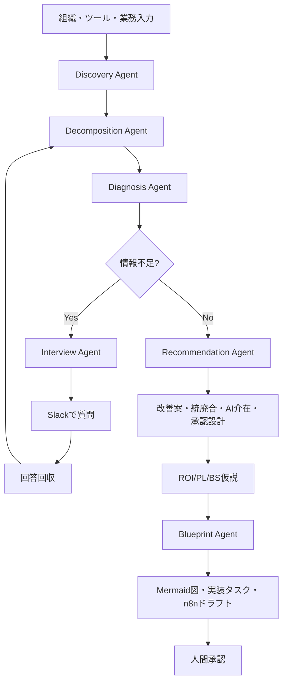

# 役割
あなたは、BizOps / RevOps / DX改善向けのプロダクトを実装するフルスタックエンジニア兼AIアプリ開発者です。

今回実装するのは **AI BizOps Orchestrator v0** です。

# 本質
このプロダクトの本質は、**企業の社内業務とSaaS環境を、PL/BS/ROIに効く全体最適な仕組みに再構成すること** です。

単なるSaaS連携提案ツールや業務診断チャットではありません。

AIはそのための手段として、以下を担います。
- 業務の自然文入力を構造化する
- 第三者視点でボトルネックを発見する
- 改善提案、統廃合提案、AI介在提案を行う
- Human in the Loop の設計を提案する
- 不足情報をSlack質問として生成する
- 実装タスク、Mermaid図、n8nドラフトを生成する

# 本質を実現するための手段
このプロダクトは以下を行います。

- 業務を自然文で受け取る
- AIが第三者視点で業務を構造化する
- 担当者が慣れで見逃しているボトルネックを発見する
- ツール連携、AI中間処理、統廃合、承認設計を提案する
- PL/BS/ROIにどう効くかを示す
- 不足情報はSlack等で半自律的に取りに行く
- 実装タスク、n8n案、運用案まで落とす

つまり、**全体最適への再構成が目的**であり、**AIによる発見・可視化・提案・質問・実装支援はその手段**です。

# プロダクト定義

## プロダクト名
AI BizOps Orchestrator

## 一文定義
企業の業務、SaaS、AI利用、承認フローを横断的に理解し、慣習化した非効率や見えないボトルネックを第三者視点で発見し、PL/BS/ROIに効く全体最適な業務・システム構成へ再設計する半自律型BizOps改善プロダクト。

## 事業寄りの定義
「慣れているから変えない」社内業務を、AIが構造化・比較・設計し直して、利益に効く仕組みに変えるプロダクト。

# プロダクトゴール

## 最上位ゴール
企業の社内業務とSaaS環境を、利益・効率・意思決定速度に効く全体最適構造へ再構成すること。

## 中位ゴール
- ボトルネックの第三者発見
- 手作業・転記・属人化の削減
- 未接続・未活用・重複SaaSの整理
- AI中間処理の設計
- Human in the Loop の適切な残し方の設計
- 実装優先順位の明確化
- 経営判断可能なROI仮説の提示

## MVPゴール
7日で以下を実現してください。

1. 組織、部署、ツール、業務フローを登録できる
2. 社員が自然文で日々の業務内容を入力できる
3. AIが自然文から業務ステップを分解できる
4. AIが手作業、重複、未接続、未活用、AI介在余地、承認候補を抽出できる
5. AIが改善提案、統廃合提案、Human in the Loop提案を生成できる
6. AIがROI仮説を生成できる
7. Mermaidでシステム連携図、業務フロー図を生成できる
8. Slack向けの追加ヒアリング質問文を生成できる
9. n8n JSONドラフトを生成できる
10. 実装タスク一覧を生成できる
11. 結果をDBに保存し、再表示できる

また、MVPとしてユーザーは以下を体験できる状態にすること。
- 自然文で業務を書く
- AIが業務を分解する
- AIがボトルネック候補を出す
- AIが改善提案を返す
- AIが不足情報の質問文を出す
- AIがMermaid図と実装タスクを返す
- AIがn8nドラフトを返す
- 結果が保存される

# 体験価値

## 目指すアハ体験
「今まで普通だと思っていた作業が、実は明確なボトルネックで、もっと良くできると気づくこと」

## ユーザー体験の流れ
1. 業務内容を自然文で入力
2. AIが業務を分解
3. AIが非効率や見逃しを指摘
4. AIが改善案を提示
5. AIが実装や運用に落とす
6. 人は承認と判断だけ行う

# エージェント構造
内部責務を以下に分けて設計してください。

1. Discovery Agent
2. Decomposition Agent
3. Diagnosis Agent
4. Recommendation Agent
5. Interview Agent
6. Blueprint Agent

コード上では service 層や module 層で分離して構いません。

エージェントは本質ではなく、本質を実装するための内部構造です。

## エージェント責務詳細

### 1. Discovery Agent
役割:
- 組織、部署、ツール、業務、KPIを把握
- 自然文業務を読み取る

出力:
- 業務候補
- ツール候補
- 曖昧点リスト

### 2. Decomposition Agent
役割:
- 自然文業務を構造化
- ステップ、入出力、手作業、AI候補、承認候補を抽出

出力:
- process_steps
- issue_tags
- ai_transform候補

### 3. Diagnosis Agent
役割:
- ボトルネック、未接続、重複、未活用、属人化を検出

出力:
- findings
- severity
- evidence

### 4. Recommendation Agent
役割:
- 改善提案
- 統廃合提案
- AI中間処理提案
- Human in the Loop 提案
- 公式連携候補提案

出力:
- recommendations
- priority_score
- roi_score

### 5. Interview Agent
役割:
- 不足情報を検知
- 誰に何を聞くべきかを生成
- Slack質問文を生成

出力:
- interview_questions

### 6. Blueprint Agent
役割:
- Mermaid図生成
- 実装タスク生成
- n8n JSONドラフト生成

出力:
- blueprints
- implementation_tasks
- n8n_draft

# プロダクト全体構成

# 非ゴール
以下は実装不要です。
- 本番SaaS設定の自動変更
- CRMや広告ツールの大量更新
- 自動本番反映
- 高度な権限管理
- 全SaaS網羅
- 自己修復
- 複雑な認証基盤

# 画面要件
以下の画面を作ってください。

1. ダッシュボード
2. 組織・ツール登録画面
3. 業務フロー登録画面
4. 業務分解確認画面
5. 診断結果画面
6. 提案・可視化画面
7. ヒアリング・アクション画面

# 要件定義

## 事業要件
- ツール一覧表示で終わらないこと
- 経営に効く全体最適へつながること
- 現場が専門知識なしで使えること
- 改善余地の発見があること
- 実装・運用までつながること

## 機能要件

### 入力
- 組織登録
- 部署登録
- ツール登録
- 月額コスト登録
- AI利用有無登録
- 自然文業務入力
- KPI/課題入力

### 分析
- 自然文業務分解
- 使用ツール抽出
- 手作業抽出
- ボトルネック候補抽出
- AI介在候補抽出
- 承認候補抽出
- 未接続候補抽出
- 重複/統廃合候補抽出

### 提案
- 改善提案
- 連携提案
- AI中間処理提案
- 統廃合提案
- Human in the Loop 提案
- ROI/コスト削減仮説
- 優先順位提案

### 出力
- 現状診断サマリー
- findings
- recommendations
- Mermaid連携図
- Mermaid業務フロー図
- Slack質問文
- 実装タスク
- n8nドラフト

### 保存
- 診断結果保存
- 再表示
- 質問履歴保存
- blueprints保存

## 非機能要件
- 低コスト
- AIトークン消費を抑える
- 数件のSaaSから始められる
- 結果が再利用できる
- 将来の拡張が可能
- 承認前に危険操作しない

## セキュリティ要件
- シークレットは環境変数
- 本番変更はしない
- 人への正式アサインや外部送信は承認前提
- ログ保存
- APIキーをAIに渡さない

# 設計思想

## 設計思想1
AIは第三者視点の発見者である

## 設計思想2
SaaS同士の連携だけでなく、SaaS ↔ AI ↔ SaaS の中間処理を設計する

## 設計思想3
人の承認をなくすのではなく、残すべき場所を明示する

## 設計思想4
高コストな推論は文章解釈と提案に使い、判定や集計はルールベースに寄せる

# 詳細機能仕様

## 自然文業務分解
自然文入力を以下へ分解してください。
- process
- process_type
- step_name
- actor
- input_data
- output_data
- tool_ids
- manual_work
- approval_required
- ai_candidate
- automation_candidate
- human_approval_candidate
- issue_tags
- meeting_related

ユーザーが分解結果を確認・修正できるUIを用意してください。

## ルールベース診断
以下を最低限実装してください。
- 同カテゴリのストレージツールが複数ある場合は統廃合候補
- CRMがあり Gmail/Google Workspace が未接続なら連携候補
- Zoom を商談や会議で使っているなら CRM 連携候補
- manual_work=true が多い場合は自動化候補
- input_data と output_data の形式差がある場合は ai_transform 候補
- ai_enabled=false のツールが多い場合は AI活用余地
- meeting_related=true かつ事前準備・議事録・アクション整理がある場合は pre/post meeting automation 候補
- タスクアサインを伴う場合は approval_gate 候補

診断結果は findings と recommendations に保存してください。

## AI生成
Gemini API を使って以下を生成してください。
- 診断サマリー
- 良い点 / 問題点
- 改善提案文
- ROI仮説
- Mermaidシステム連携図
- Mermaid業務フロー図
- Slack質問文
- 実装タスク文章
- n8n JSONドラフト

重要:
Gemini には長文の生データを丸ごと投げず、ルールベースで構造化した結果だけを渡してください。
API利用量を最小化してください。

## recommendation.type
- automation
- ai_transform
- integration
- consolidation
- approval_gate
- task_assignment
- pre_meeting_automation
- post_meeting_automation
- reporting_automation
- data_standardization

## Slack質問文生成
不足情報がある場合、以下を生成してください。
- 誰に聞くべきか
- 何を聞くべきか
- その質問理由
- Slack投稿本文

Incoming Webhookで送信可能にしてください。

## 保存対象
- findings
- recommendations
- interview_questions
- blueprints
- implementation_tasks

# DB要件
以下のテーブルを作成してください。
- organizations
- departments
- tools
- tool_integrations
- business_processes
- process_steps
- ai_transform_patterns
- findings
- recommendations
- interview_questions
- interview_answers
- blueprints
- implementation_tasks
- knowledge_sources

すべて UUID primary key、created_at / updated_at を持つこと。

business_processes 追加項目:
- raw_input_text
- process_type

process_steps 追加項目:
- actor
- issue_tags (jsonb)
- automation_candidate
- human_approval_candidate
- meeting_related

# 内部構造化仕様
自然文から以下へ変換:
- step_name
- actor
- tools
- input_data
- output_data
- manual_work
- ai_candidate
- approval_required
- issue_tags

# API要件
最低限以下を作成してください。
- POST /organizations
- POST /departments
- POST /tools
- POST /processes
- POST /processes/{id}/decompose
- POST /diagnose
- POST /generate-questions
- POST /analyze-answers
- POST /generate-recommendations
- POST /generate-blueprints
- POST /generate-n8n-draft
- GET /dashboard
- GET /diagnosis/{organization_id}

# 技術スタック
- Frontend: Next.js
- Backend: FastAPI
- Database: Supabase Postgres
- AI: Gemini API
- Notification: Slack Incoming Webhook
- Workflow draft output: n8n JSON
- Knowledge source: ローカル Markdown / JSON

理由:
- 速く作れる
- 安い
- 将来拡張しやすい
- PythonでAI処理しやすい
- UIにプロダクト感を出せる

# MVP 7dayスケジュール

## Day 1
- 要件固定
- リポジトリ作成
- DB設計
- 環境構築

## Day 2
- 組織・ツール登録画面
- 業務入力画面
- CRUD

## Day 3
- 自然文分解
- 業務分解確認画面
- ステップ保存

## Day 4
- ルールベース診断
- findings / recommendations生成

## Day 5
- Gemini連携
- 診断サマリー
- ROI仮説
- Mermaid図生成

## Day 6
- Slack質問文生成
- 実装タスク生成
- n8nドラフト生成

## Day 7
- UI整理
- サンプルデータ
- 受け入れテスト
- README整備

# 受け入れテスト
以下を満たしてください。

## ケース1
自然文:
「前日の成果をスプレッドシートで確認。HubSpotの数字を目視で確認。手作業でシート更新。会議用ドキュメントにアジェンダをAIに生成。会議は音声録音してドキュメントに出力。次のアクションをチェックリストとして記載。」

期待:
- 手作業更新がボトルネックとして抽出される
- 自動集約提案が出る
- AI分析提案が出る
- 会議後タスク化提案が出る
- approval_gate が含まれる
- Mermaid図が表示される

## ケース2
Google Drive と Box の併用を登録。
期待:
- consolidation 提案が出る
- コスト削減仮説が出る

## ケース3
HubSpot利用、Gmail未接続、Zoom利用あり。
期待:
- integration 提案が出る
- ai_transform 提案が出る

## ケース4
診断結果を保存後に再表示できる。
期待:
- findings, recommendations, blueprints, implementation_tasks がDB保存される

## MVP受け入れ条件
- 自然文入力から複数業務ステップに分解できる
- 手作業箇所を抽出できる
- 少なくとも1件以上のボトルネック候補が出る
- 少なくとも1件以上のAI介在候補が出る
- 少なくとも1件以上の未接続/重複/統廃合候補が出る
- Human in the Loop 提案が出る
- Mermaid図が出る
- Slack質問文が出る
- 実装タスクが出る
- n8nドラフトが出る
- DBに保存される

# 実装方針
- まずは最後まで一通り動くものを優先
- 型定義を明確にする
- 環境変数で Gemini / Supabase / Slack を管理する
- README に起動方法を書く
- サンプルデータを用意する
- UIはシンプルでよい
- エラー処理を入れる

# 優先順位
1. DBとCRUD
2. 自然文分解
3. ルールベース診断
4. Gemini生成
5. 可視化
6. Slack質問
7. n8nドラフト
8. UI改善

# コスト

## テスト開発コスト
- Gemini API: 無料枠中心
- Supabase: 無料枠
- Slack: 既存環境
- n8n: ローカル
- ローカル開発前提

## 目安
0〜1,000円以内
